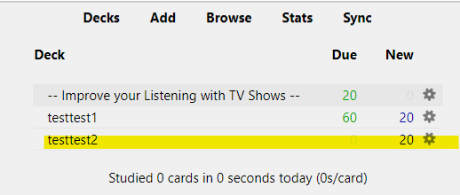

# Learn English or any Language for free

In this tutorial I will show to you how to use open source softwares to learn any language you want. I will show how to apply this for English, but you can use it for other languages. All you need is video or audio files or youtube videos.

## 1. My methodology

I will use the awesome software [Anki](https://ankiweb.net/about) as the basis of this methodology. Put it simple, you can transform anything to flashcards. A flashcard has two sides: front and back. In the front you place the question and in the back you place the answer. Anki will give the possibility to rank the difficulity of the question: if it is too easy, it will show it to you rarely. However, if it is hard it will show it more often. And here comes the power of this method: it will show you what you need to learn more often.

Below is an example of the flashcard that we will generate:


The front contains a sentence while the back contains the audio.
By practising on a daily basis, let's say for 10 minutes per day will be able to enhance your learning x 10 when compared to the classical techniques.
[Anki](https://ankiweb.net/about) allows you to sync your deck (a deck is a group of flashcards) with you mobile phone by using the application developped by their team. This is great because you can emphasize on practicing wherever you are ! All you need here is to signup for a free account.

Now that you know about Anki, my methodology consists of three steps:

1. Gather videos/audios. This can be anything your are interested of (a film, series, etc.). You can use this repository to download any youtube video you want: [youtube-dl](https://github.com/ytdl-org/youtube-dl)
2. Use this repositoty to get subtitles: [autosub](https://github.com/BingLingGroup/autosub)
3. Create a new deck on Anki by using [bulk importer](https://ankiweb.net/shared/info/1312111882) add-on (As of now it works with Anki version 2.1.44). Start learning !

An example of the methodology:


## 2. Installation

Be sure to install the following list of requirements:

1. [choco](https://chocolatey.org/install) (for Windows, for Linux you can use `apt`)
2. Then use choco to install the following softwares:  
   [ffmpeg](https://ffmpeg.org/), [git](https://git-scm.com/) and curl, by issuing the following command from your terminal (cmd or powershell for Windows):
   ```
   choco install ffmpeg git curl -y
   ```
3. Ensure that you have a working python3:  
   Install [miniconda](https://docs.conda.io/en/latest/miniconda.html)  
   After install, open Miniconda prompt and create a new environment (we will call it `learnenglishfree`):
   ```
   conda create -n learnenglishfree
   ```
   Activate the environment:
   ```
   conda activate learningenglishfree
   ```
   Then install all the required requirements:
   ```
   pip install -r requirements.txt
   ```

## 3. Procedure

First, `clone` or download this repository anywhere on your machine:

```
git clone https://github.com/mchaitou/learn-english-free.git
```

After collecting a number of videos/audios of your interest, take one of them (you can repeat the procedure for the others) and place it inside the folder `fragments` of this repository. Then issue the following command from your miniconda prompt:

```
cd fragments
autosub -i <media file> -k -S en -F json

```

(Note that autosub has been installed when you issued `pip install -r requirements.txt` above).
This will create a bunch of audio files that end with `.flac`. In addition, it will create a text file (aka json file) that ends with `.json`.
Your next step is to launch this command:

```
cd ..
python split_transcript.py
```

This will populate the folder `text_dir` of this repository with a bunch of text files. Each of those files contains a sentence for an audio file in folder `fragment` (they both have the same name but they differ by the extension: `.txt` vs `.flac`)

Then since the Anki Bulk importer addon does not accept `.flac` I have to convert them to `mp3`. So run this command:

```
python flac_to_mp3.py
```

And finally, convert the text to images to be show in the flashcards:

```
python text_to_img.py
```

So you will end with two folders: `fragments` contains the audio and `text_dir` contains the `subtitles`

## 4. Importing to Anki

First download and install [Anki](https://ankiweb.net/about). You can also install their application on your phone if you want to sync your learning between your laptop and your phone
([Ankidroid](https://play.google.com/store/apps/details?id=com.ichi2.anki&hl=en_US&gl=US)). Note that you can find an alternative for Iphone.

Go to `tools --> Add-ons` and install `Bulk importer`.

.

Then open `Bulk importer`


Then as shown by the figure below, choose button `Load pics` to select all elements in folder `text_dir` (`ctrl + A`) and button `Load Audio` for folder `fragments`. In `Prompt` you can put anythin then click on `Copy 1st row to all` and you do not have to put anything under `Response`.
And that is it! when selecting the name of the deck I choose `testtest2` as a new name:
Click on `Import` and you are all set.  


Then you can start learning by clicking on the deck.  



